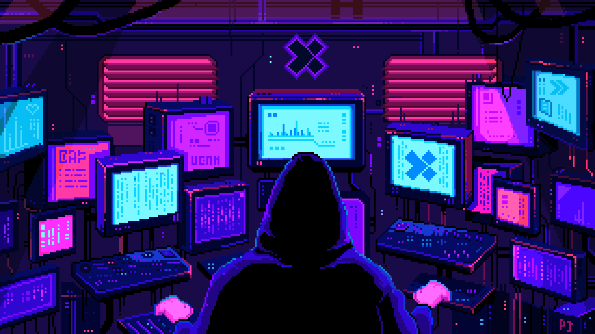
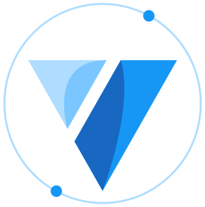
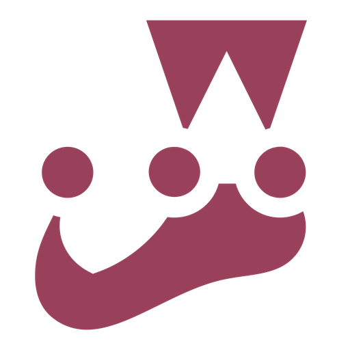

<h1 align="center">👋 Всем привет. Я Senior Frontend developer</h1>

    

### 🛠 &nbsp;Core Languages and Tools + Backend Stack :

&nbsp;
&nbsp;
&nbsp;
&nbsp;
&nbsp;
&nbsp;
&nbsp;
&nbsp;
&nbsp;
&nbsp;
&nbsp;
&nbsp;
&nbsp;
&nbsp;
&nbsp;

  
  

### 👀 Frontend - development stack

    
    
    
    

  
   

   
    
   
    
    
   
   
  
        
    
 
    
    
    
    
    
    
    
    

---

### 💻 Backend - development stack

    
    
    
    
    

 
  

- 🌱 В текущий момент работаю в IT компании
- 💞️ Ищу единомышленников для обмена опытом и разработки интересных проектов
- 📫 Со мной связаться можно по мобильному телефону, Telegram, WhatsApp
- 🎓 Являюсь личным ментором и консультантом по IT направлению (помощь в успешных прохождениях собеседований, помощь в review кода)
